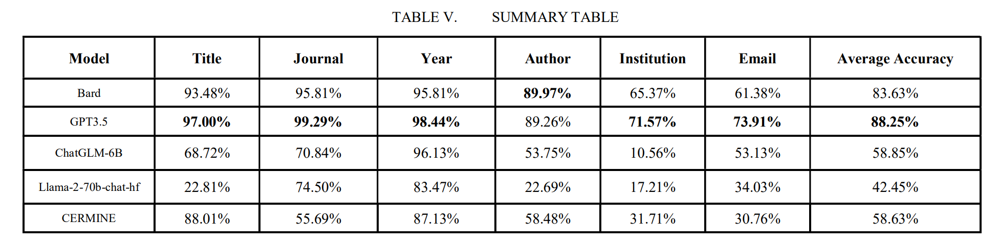

# SLIME-LLM-Benchmark
This is the Benchmark of our paper [《Investigations on Scientific Literature Meta   Information Extraction Using Large Language  Models 》](https://ieeexplore.ieee.org/abstract/document/10412837)




```bibtex
@INPROCEEDINGS{10412837,
  author={Guo, Menghao and Wu, Fan and Jiang, Jinling and Yan, Xiaoran and Chen, Guangyong and Li, Wenhui and Zhao, Yunhong and Sun, Zeyi},
  booktitle={2023 IEEE International Conference on Knowledge Graph (ICKG)}, 
  title={Investigations on Scientific Literature Meta Information Extraction Using Large Language Models}, 
  year={2023},
  pages={249-254},
  keywords={Measurement;Knowledge graphs;Information retrieval;Data mining;Task analysis;information extraction;large language model;scientific literature},
  doi={10.1109/ICKG59574.2023.00036}}
```
